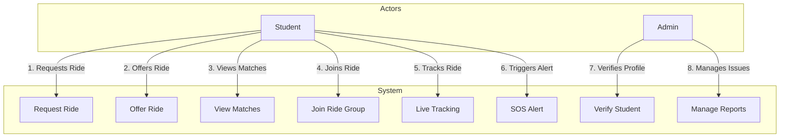
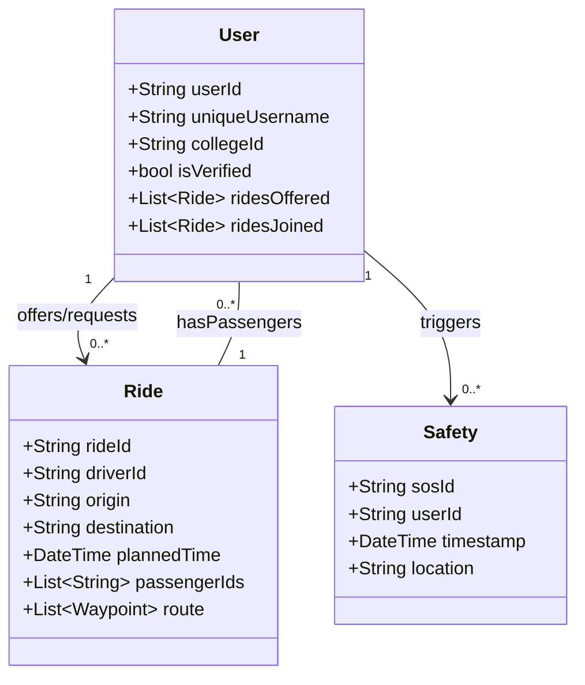
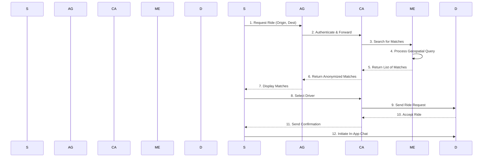

# MitraRide: System Design & UML Diagrams

This document provides a visual representation of the MitraRide system's core components and their interactions using various diagrams.

---

### 1. Use Case Diagram

This diagram outlines the primary functions of the MitraRide application and the actors who interact with them.

---

### 2. Class Diagram
This diagram provides a high-level view of the key data entities and their relationships within the MitraRide system.

---

### 3. Sequence Diagram
This diagram illustrates the step-by-step interaction between a student, the system backend, and other users when a ride is requested.

